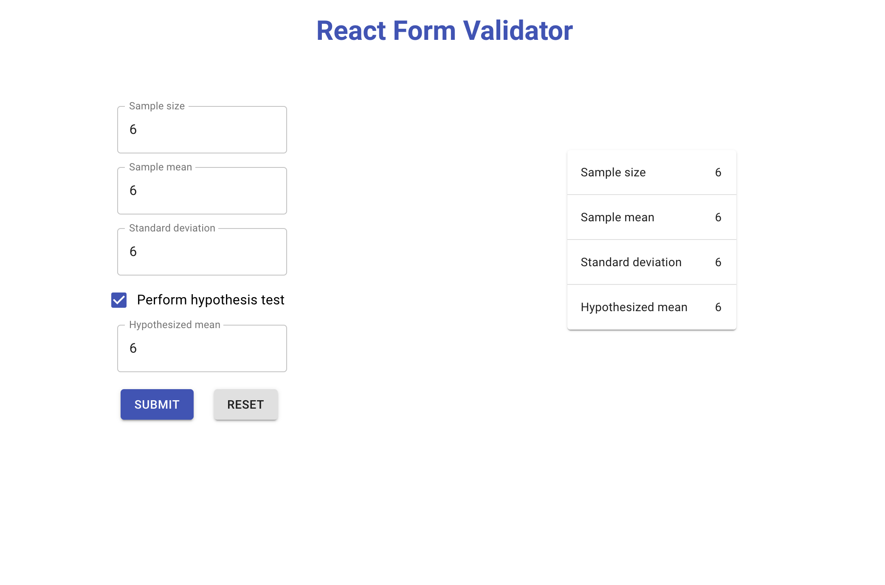

# React Form Validator

### About this project

This simple responsive application consists of a form that accepts either 3 or 4 arguments and validates their input. The arguments are as follows:

- Sample size: whole number >= 2
- Sample mean: any numeric value
- Standard deviation: any numeric value > 0
- Hypothesized mean: any numeric value

If the input does not pass the validation test, a message prompts the user to use said constraints. On submit, the values are rendered in a table. When the reset button is clicked, the table disappears and all values are reset to their inital state.

### Installation

to open this project locally either clone or fork and clone this repo. In the command line, run `git clone <origin>`. From inside the project run `npm install` to install dependencies. finally, run `npm start` to open the project on a local server.

This project was initialized using `create-react-app`.

### Motivations

I decided to use this project to familiarize myself with react hooks and material UI. There is barely any CSS in this project. In the future, I plan on refactoring this code to use custom hooks.

### Technology Used

- HTML
- CSS
- Javascript
- React JS
- Material UI
